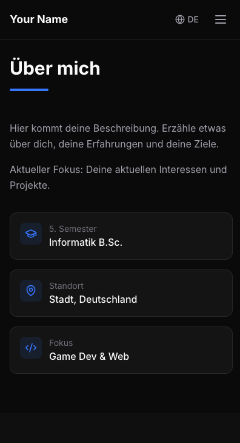

<div align="center">

# ✨ Nextfolio

**A stunning, modern portfolio template for developers**

Built with Next.js 14 • TypeScript • Tailwind CSS • Framer Motion

[](https://nextjs.org/)
[](https://www.typescriptlang.org/)
[](https://tailwindcss.com/)
[](LICENSE)

[Demo](https://your-demo-url.vercel.app) • [Features](#-features) • [Quick Start](#-quick-start) • [Customization](#-customization) • [Deploy](#-deploy)

</div>

---

## 🎯 Features

| Feature | Description |
|---------|-------------|
| 🌍 **Bilingual** | Built-in German/English support with one-click toggle |
| 🌙 **Dark Mode** | Sleek dark theme designed for developers |
| 📱 **Responsive** | Mobile-first design that looks great on all devices |
| ⚡ **Blazing Fast** | Static generation with Next.js for optimal performance |
| ✨ **Animated** | Smooth scroll-reveal animations powered by Framer Motion |
| 🎨 **Customizable** | Easy data-driven content management |
| 🔍 **SEO Ready** | Optimized metadata for search engines |
| ♿ **Accessible** | Built with accessibility in mind |

---

## 🖼️ Preview

<div align="center">

| Desktop | Mobile |
|---------|--------|
|  |  |

</div>

> 📸 *Add your own screenshots to `public/` after customizing*

---

## 🚀 Quick Start

### Prerequisites

- **Node.js 18+** (recommended: use [nvm](https://github.com/nvm-sh/nvm))
- npm, yarn, or pnpm

### Installation

```bash
# Clone this repository
git clone https://github.com/yourusername/nextfolio.git

# Navigate to the project
cd nextfolio

# Install dependencies
npm install

# Start development server
npm run dev
```

🎉 Open **[http://localhost:3000](http://localhost:3000)** and see your portfolio!

---

## 📁 Project Structure

```
nextfolio/
├── public/              # Static assets (images, resume, favicon)
├── src/
│   ├── app/
│   │   ├── layout.tsx   # Root layout with fonts & metadata
│   │   ├── page.tsx     # Main page component
│   │   └── globals.css  # Global styles & Tailwind config
│   ├── components/
│   │   ├── layout/      # Header, Footer
│   │   ├── sections/    # Hero, About, Skills, Projects, etc.
│   │   └── ui/          # Reusable UI components
│   ├── data/            # 📝 Your content goes here!
│   ├── hooks/           # Custom React hooks
│   ├── lib/             # Utility functions
│   └── types/           # TypeScript definitions
├── package.json
└── tailwind.config.ts
```

---

## ✏️ Customization

### 1. Update Your Content

All your personal information is stored in `src/data/`. Edit these files:

| File | Content |
|------|---------|
| `profile.ts` | Name, bio, email, social links |
| `projects.ts` | Your projects with descriptions & links |
| `skills.ts` | Technical skills organized by category |
| `experience.ts` | Work & volunteer experience |
| `education.ts` | Educational background |
| `languages.ts` | Language proficiencies |

### 2. Add Your Images

```bash
public/
├── projects/        # Project screenshots
│   └── my-app.png
├── resume.pdf       # Your downloadable resume
└── og-image.png     # Social media preview image
```

### 3. Customize Colors

Edit the CSS variables in `src/app/globals.css`:

```css
:root {
  --background: #0a0a0a;
  --foreground: #fafafa;
  --accent: #3b82f6;
  /* ... more colors */
}
```

### 4. Update Metadata

Edit `src/app/layout.tsx` to update:
- Site title & description
- Open Graph images
- Keywords & author info

---

## 🌐 Deploy

### Vercel (Recommended)

[](https://vercel.com/new/clone?repository-url=https://github.com/yourusername/nextfolio)

1. Push your code to GitHub
2. Import the repository on [Vercel](https://vercel.com)
3. Deploy automatically ✨

### Other Platforms

Works with any Next.js hosting:

| Platform | Guide |
|----------|-------|
| Netlify | [Deploy to Netlify](https://docs.netlify.com/integrations/frameworks/next-js/overview/) |
| Cloudflare Pages | [Deploy to Cloudflare](https://developers.cloudflare.com/pages/framework-guides/nextjs/) |
| AWS Amplify | [Deploy to Amplify](https://docs.amplify.aws/guides/hosting/nextjs/q/platform/js/) |

### Build Commands

```bash
# Production build
npm run build

# Start production server
npm run start

# Lint code
npm run lint
```

---

## 🛠️ Tech Stack

| Technology | Purpose |
|------------|---------|
| [Next.js 14](https://nextjs.org/) | React framework with App Router |
| [TypeScript](https://www.typescriptlang.org/) | Type safety |
| [Tailwind CSS](https://tailwindcss.com/) | Utility-first styling |
| [Framer Motion](https://www.framer.com/motion/) | Animations |
| [Lucide React](https://lucide.dev/) | Icons |

---

## 📄 License

MIT License - Use this template freely for your personal or commercial projects!

---

<div align="center">

**[⬆ Back to Top](#-nextfolio)**

Made with ❤️ using Next.js

⭐ Star this repo if you found it helpful!

</div>